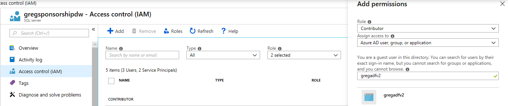

# Automating Azure SQL DW - Code Samples
My Ignite 2018 presentation entitled [Automating Azure SQL Data Warehouse](https://myignite.techcommunity.microsoft.com/sessions/66195?source=sessions) on September 26, 2018 included demos of various ways to automate Azure SQL DW. These code samples are included here.

### [ADFv2](https://github.com/furmangg/automating-azure-sql-dw/tree/master/ADFv2)

#### BackupAzureSQLDW

The ADFv2/BackupAzureSQLDW.json file contains an Azure Data Factory v2 pipeline which triggers a backup of your Azure SQL DW. In proper terms, this pipeline creates a [user-defined restore point](https://docs.microsoft.com/en-us/azure/sql-data-warehouse/backup-and-restore#user-defined-restore-points) in your DW. If you DW is paused through the day except for a few hours during the loads then it may not be online long enough to get an automatic restore point created. Furthermore, automatic restore points may happen in the middle of a load making them useless for a restore. Triggering a user-defined restore point ensures you backup the DW at a consistent point before or after a load.

Set the following parameters upon execution of the pipeline:
* **SubscriptionID** - The GUID identifier for the subscription the Azure SQL DW is running from. To get this ID, go to the Subscriptions tab of the Azure Portal.
* **ResourceGroup** - The name of the resource group where the Azure SQL DW lives.
* **Server** - The name of your Azure SQL DW server. This is not the full _yourdwserver.database.windows.net_ server name. This is just the initial _yourdwserver_ section.
* **DW** - The name of the DW database.

This pipeline executes the command under your ADF Managed Service Identity (MSI). Thus that MSI must be granted proper permissions. If your data factory is named "gregadfv2" then go to the Access Control (IAM) tab in the Azure SQL Server's blade, click Add, choose Role=Contributor, then search for your data factory's name, select the MSI that is returned from the search and click Save:

#### PauseAzureSQLDW

The ADFv2/PauseAzureSQLDW.json file contains an Azure Data Factory v2 pipeline which pauses your DW and loops until the pause is complete. This pipeline immediately pauses your DW without checking whether any queries or loads are running.

Set the following parameters upon execution of the pipeline:
* **SubscriptionID** - The GUID identifier for the subscription the Azure SQL DW is running from. To get this ID, go to the Subscriptions tab of the Azure Portal.
* **ResourceGroup** - The name of the resource group where the Azure SQL DW lives.
* **Server** - The name of your Azure SQL DW server. This is not the full _yourdwserver.database.windows.net_ server name. This is just the initial _yourdwserver_ section.
* **DW** - The name of the DW database.

This pipeline executes the command under your ADF Managed Service Identity (MSI). Thus that MSI must be granted proper permissions as explained in the instructions for BackupAzureSQLDW above.

#### ResumeAzureSQLDW

The ADFv2/ResumeAzureSQLDW.json file contains an Azure Data Factory v2 pipeline which resumes (unpauses) your DW and loops until the DW is online. If the DW is already online then it does nothing.

Set the following parameters upon execution of the pipeline:
* **SubscriptionID** - The GUID identifier for the subscription the Azure SQL DW is running from. To get this ID, go to the Subscriptions tab of the Azure Portal.
* **ResourceGroup** - The name of the resource group where the Azure SQL DW lives.
* **Server** - The name of your Azure SQL DW server. This is not the full _yourdwserver.database.windows.net_ server name. This is just the initial _yourdwserver_ section.
* **DW** - The name of the DW database.

This pipeline executes the command under your ADF Managed Service Identity (MSI). Thus that MSI must be granted proper permissions as explained in the instructions for BackupAzureSQLDW above.

